## Sesion 9

Creacion de IOT hub

Creación de dispositivo de IOT hub

Ingresar a 

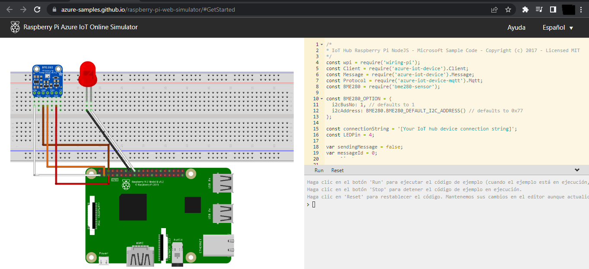
Sensor de temperatura conectado a un led y todo conectado a un arduino por medio de una protovolt

CREACION DE CENTRO IOT

En el portal de azure buscar "Centro de IOT"

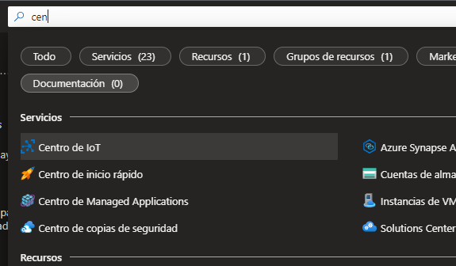

Completar los datos, revisar y crear

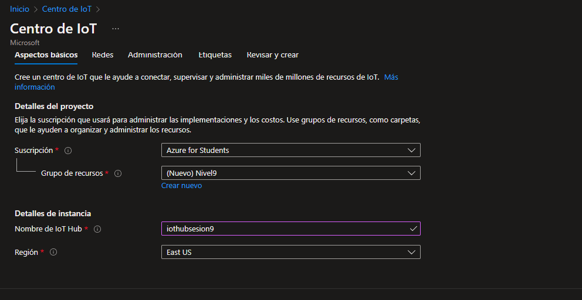

Ir al recurso creado

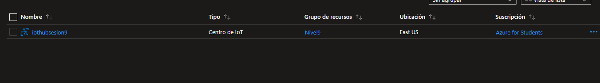

Crear dispositivo

Ir a dispositivo y crear uno 

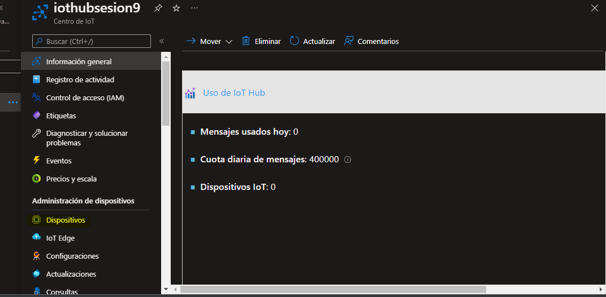

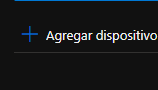

Y guardar

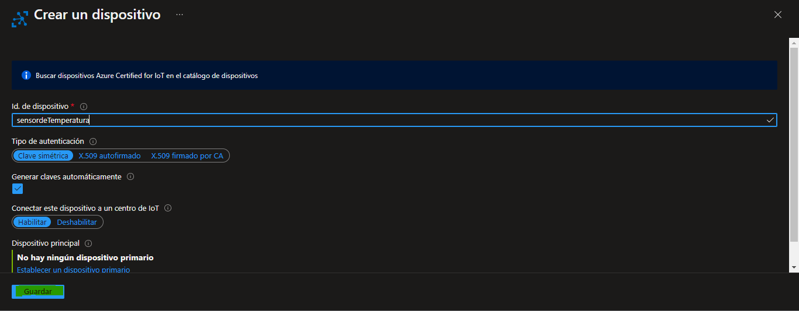

Ir al recurso y copiar cadena de conexión principal y pegarlo en Raspberry Pi Azure IoT Online Simulator, su funcion es enviar informacion a Azure

Conectado

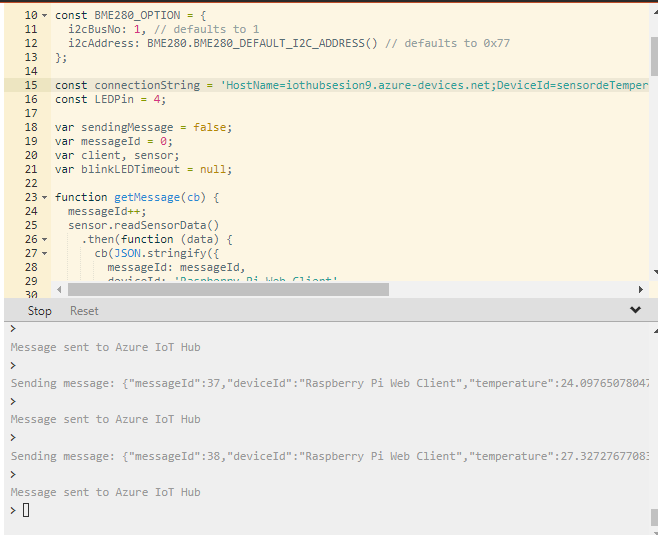

Ingresar a github

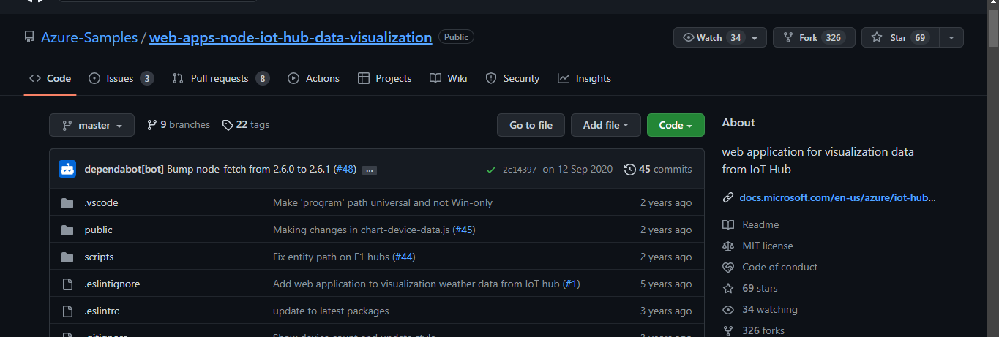

Crear un clon del repositorio seleccionar "code" y copiar el link que presenta

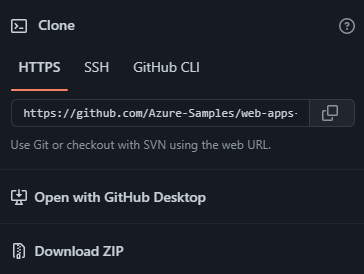

Copiar el link, teclear git clone y pegar el acceso, su función es recibir información

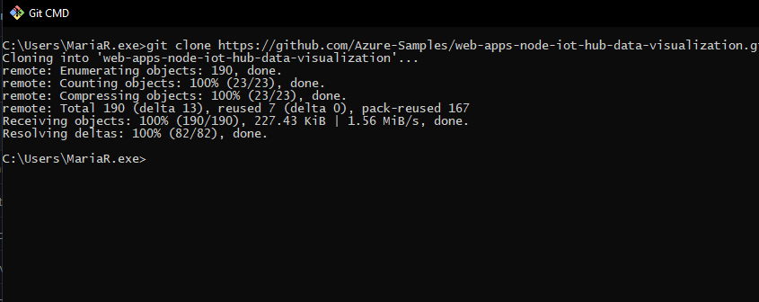

Utilizando la terminal de azure, introducir primero Az y escribir lo subrayado en amarillo

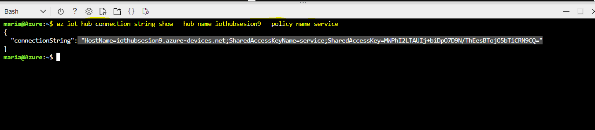

El hostname anterior introducirlo en visual studio code

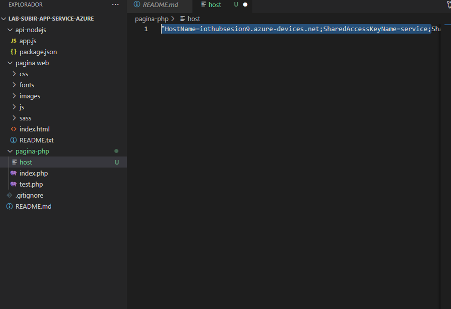

CREAR EN CONSUMER GROUP 
brinda instrucciones para saber a donde mandar la informacion
EN CMD se teclea az y enter, luego aparece la ventanilla de la siguiente manera

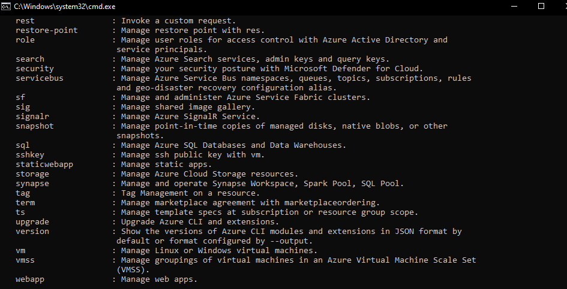

Para la creación de grupo de consumo 

Enter

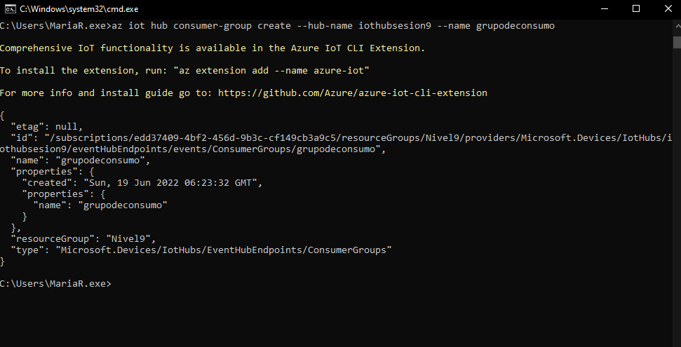

Instalar node.js

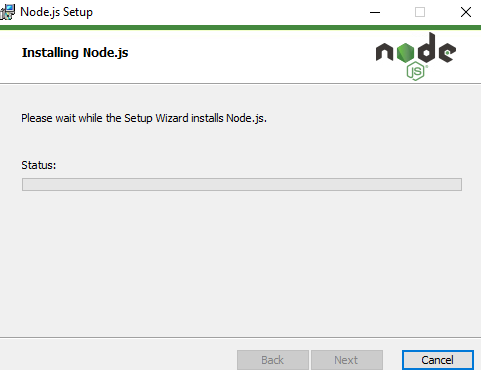

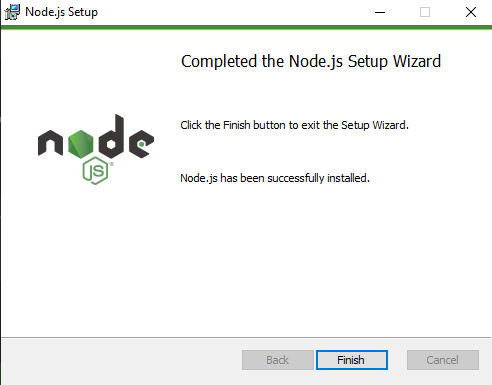

En cloud shell poner “npm install” para que se lleve a cabo el proyecto

# Sesion9
